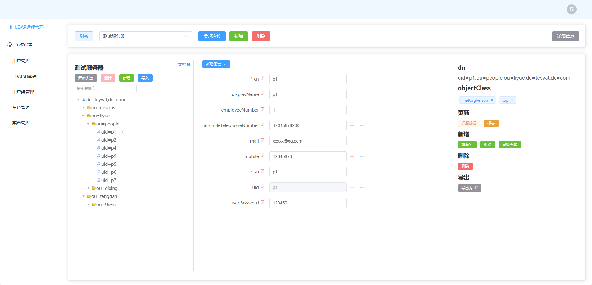
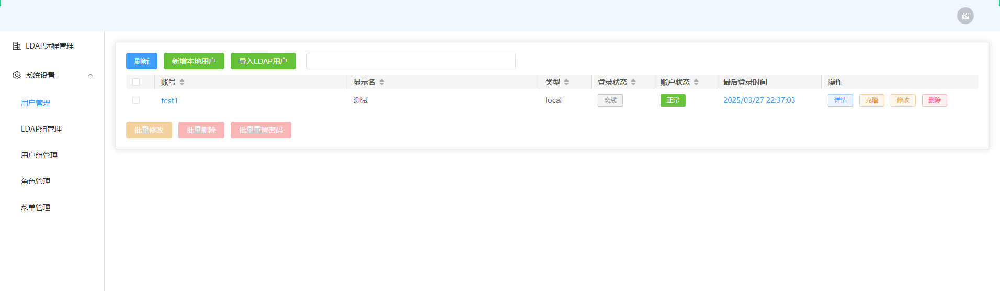
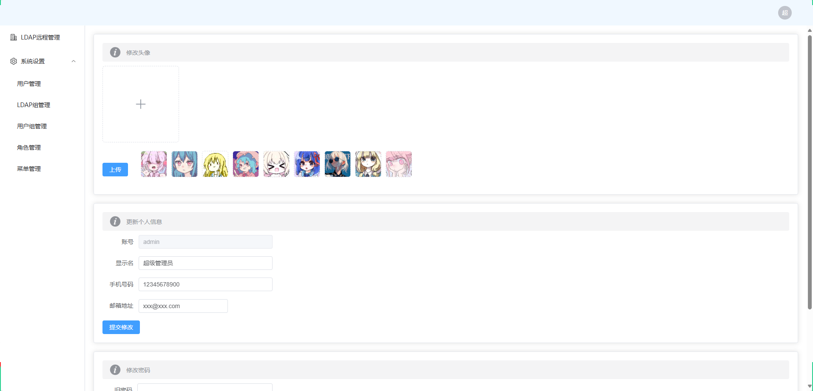

# OpenLdapUi-IAM
项目地址: 
- [github](https://github.com/Teasnowy/OpenLdapUi-IAM)
- [gitee](https://gitee.com/qufudcj/OpenLdapUi-IAM)


带有登录认证功能的openldap工具
> [无认证版](https://github.com/Teasnowy/OpenLdapUi)
- 支持使用nacos托管配置文件
- 支持使用redis缓存

admin初始密码为123456






# 构成
- api目录: python (建议版本3.8+)
- web目录: vue3 + vite

# 容器运行
> 容器内已集成redis和nginx, 设定为上海时区和中文环境

### 需要注意的地方
- nacos、redis、短信、邮箱、登录 等自定义配置需要修改容器内配置文件/openldapui-iam/api-iam/config/global.yaml, 可以考虑将其映射到宿主机以方便修改, 除database配置项外其配置均支持热修改, 约60秒生效
- 默认启用redis (容器已内置redis:7.2.7)
- 默认使用本地配置文件
- 需要先初始化数据库
### 容器内变量
|变量名|作用|可选值|默认值|
| ---- | --- | --- | --- |
|UIIAM_CONFIG_MODE|从哪读取配置|'nacos'\|'local'|local
|UIIAM_DB_MODE|使用的缓存类型|'redis'\|'diskcache'|redis
|MYSQL_HOST|mysql地址||
|MYSQL_PORT|mysql端口||3306
|MYSQL_USER|mysql登录用户||
|MYSQL_PASSWORD|mysql登录密码||
|MYSQL_DB|mysql数据库||
|MYSQL_CHARSET|字符集||utf8
|MYSQL_MAXCONNECTIONS|最大连接数||5

### 运行容器
```shell
# 在mysql数据库导入 api-iam/doc/init.sql
mysql -uroot -pyourpasswd yourdb < api-iam/doc/init.sql
# 拉取镜像
docker pull qufudcj/openldapui-iam:v2
# 酌情修改变量值
docker run -dit --name openldapuiiam -p 80:80 -p 997:997 -e MYSQL_HOST=x.x.x.x -e MYSQL_PORT=3306 -e MYSQL_USER=root -e MYSQL_PASSWORD=123456 -e MYSQL_DB=xxxx qufudcj/openldapui-iam:v2
```

# 自行编译
```
cd web-iam
npm run build
mv dist ../web-iam-dist
```

# 下载编译好的
web-iam-dist目录就是编译好的前端静态文件, 可直接用于web服务器
- [百度云盘下载](https://pan.baidu.com/s/1PVYWnMvZTPaQjcw2MNclJw?pwd=9127)

# 运行环境
### 后端部分
初始化
```shell
# 安装依赖
pip install -r api-iam/requeirments.txt
# 在mysql数据库导入 api-iam/doc/init.sql
mysql -uroot -pyourpasswd yourdb < api-iam/doc/init.sql
```
修改启动参数 (需要修改server-openldapuiiam.sh的14~15行, 或直接运行OpenLdapUi-IAM-api.py)
|参数|作用|可选值|默认值|
| ---- | --- | --- | --- |
|-m|从哪读取配置|'nacos'\|'local'|local
|-d|使用的缓存类型|'redis'\|'diskcache'|diskcache
|-f|本地配置文件(仅-m为local时生效)||config/global.yaml
|-p|mysql端口||997

启动
```shell
# 如需修改启动参数或日志路径等启动配置, 可修改server-openldapuiiam.sh的前几行变量, 都有注释
# 启动
/bin/bash server-openldapuiiam.sh start
# 停止
/bin/bash server-openldapuiiam.sh stop
# 重启
/bin/bash server-openldapuiiam.sh restart
```

### 前端部分
依赖web服务器, 以下举例nginx
```
server  {
    listen       80;
    index index.html index.htm index.php;
    # 你手动编译或下载编译好的web目录
    root  /xxxx/web-iam-dist;

    # /api是后端接口
    location /api {
        if ($request_method = 'OPTIONS') {
             return 200;
        }
        # 酌情修改997端口号
        proxy_pass   http://127.0.0.1:997;
        proxy_next_upstream off;
        proxy_set_header Upgrade $http_upgrade;
        proxy_set_header Connection "upgrade";
    }
}
```
